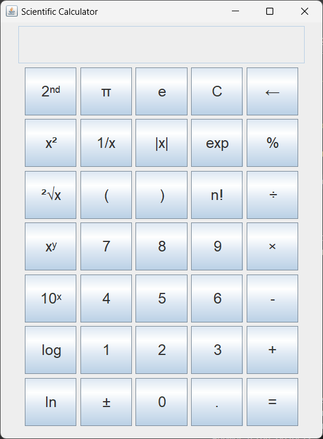

# Scientific Calculator

A relatively basic scientific calculator made entirely in Java

## Description

A scientific calculator that appears in a new window when the program is ran. The visuals are all made in Java, so they are very basic. It can do most of the basic function of a scientific calculator such as:

- basic operations
- exponents
- logarithms
- trig functions (in radians)

An image showing the UI that appears when the program is run is shown below:

## Folder Structure

The only folder on GitHub is the  `src` folder that is used to maintain sources.

## Execution

I ran this using the in app run command for VSCode with the "Test Runner for Java" extension in the "Extension Pack for Java" package in VSCode, but any way to run java files should be viable.
