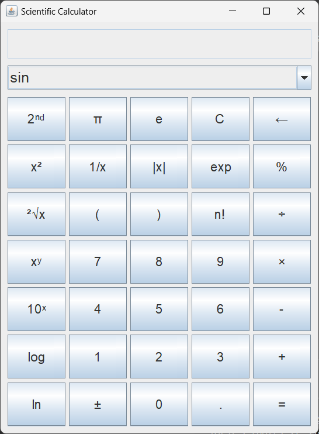

# Scientific Calculator

A relatively basic scientific calculator made entirely in Java.

## Description

A scientific calculator that appears in a new window when the program is ran. It can do most of the basic functions of a scientific calculator such as:

- basic operations
- exponents
- logarithms
- absolute values
- trig and inverse trig functions (in radians)
- error checking

The visuals are all made in Java, so they are very basic. An image showing the UI that appears when the program is run is shown below:

## Folder Structure

- `src`: the folder to maintain sources
- `bin`: the folder with compiled output files from running the program in VSCode (not shown on GitHub)
- `images`: the folder for the images that are embedded in the README.md file

## Execution

I ran this using the in app run command for VSCode with the "Test Runner for Java" extension in the "Extension Pack for Java" package in VSCode, but any way to run java files should be viable.
